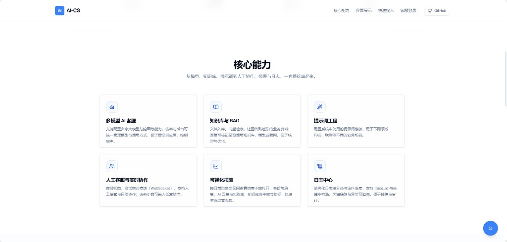
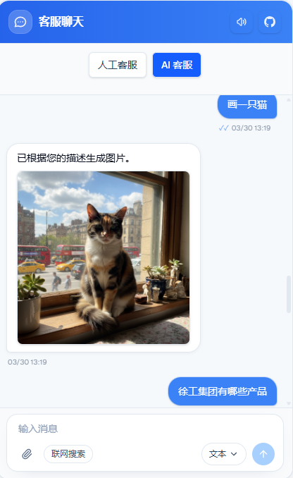

# AI-CS 智能客服系统

> 开源的 AI 客服系统：**AI + 人工一体**、可私有化部署、可配置、可观测。  
> 适合把“官网右下角客服小窗”与“客服工作台”一起落地的团队。

## 界面预览

> 截图放在仓库内的 **`assets/readme/`**（随 Git 提交），README 里使用**相对路径**引用。  
> 请勿使用 `file:///...` 或仅本机存在的路径，否则在 GitHub / Gitee 等页面上无法显示。

**官网首页（核心能力模块）**



**客服小窗（人工客服模式）**


**客服小窗（AI 客服模式）**



## 在线演示

- **官网首页（产品介绍 + SEO）**：[demo.cscorp.top](https://demo.cscorp.top)
- **访客聊天页**：[demo.cscorp.top/chat](https://demo.cscorp.top/chat)（也可从首页右下角按钮进入）
- **客服登录**：[demo.cscorp.top/agent/login](https://demo.cscorp.top/agent/login)

## 你能用它做什么（功能回顾）

- **访客侧（嵌入小窗）**
  - 右下角聊天小窗，可嵌入任意网站（iframe 方式）
  - 支持 AI 模式 / 人工模式切换、消息提示音、文件上传
  - 可选“本回合联网搜索”开关（是否对访客展示可在后台控制）
- **客服侧（工作台）**
  - 会话列表、实时消息（WebSocket）、未读角标提示
  - 支持“实时共享草稿输入”（双方未发送内容可实时可见）
  - 多模型管理（文本/绘画等）与对话配置
  - **提示词配置**（Prompt 管理）
  - **知识库管理 + RAG**（向量检索，可按需启用；向量库不可用时可不影响启动）
  - **日志中心**：结构化日志落库，支持按级别/分类/事件/trace_id/关键字筛选排障
  - **数据报表**：按日/区间查看访客打开小窗、会话与消息、AI 回复与失败率、知识库命中率、转人工等指标
- **官网与 SEO（面向获客）**
  - 蓝白主题官网首页，分段渐变与滚动进场动效
  - `metadata` / Open Graph / JSON-LD / `sitemap.xml` / `robots.txt`，便于搜索引擎收录与社交分享
- **可选联网搜索（Web Search）**
  - 支持 **Serper**：MCP 接入（`SERPER_MCP_URL`）或直连 API（`SERPER_API_KEY`）
  - 也支持“厂商内置 web search”（由模型自己决定是否搜）的 function calling 流程（按模型能力与供应商而定）

## 快速开始（只维护根目录 `/.env`）

> 统一配置真源：**只维护项目根目录 `/.env`**。Docker 与本地启动都读这一份。  
> 初始化：复制 `/.env.example` 为 `/.env` 并填写必填项。

### 方式 A：预构建镜像部署（推荐，最省事）

#### 1）准备配置

```bash
git clone https://github.com/2930134478/AI-CS.git
cd AI-CS
cp .env.example .env
```

至少要改（必填）：
- **数据库**：`MYSQL_ROOT_PASSWORD`、`DB_PASSWORD`
- **管理员**：`ADMIN_PASSWORD`
- **安全密钥**：`ENCRYPTION_KEY`（64 位 hex）

生成 `ENCRYPTION_KEY`：

```bash
# Linux/Mac
openssl rand -hex 32

# Windows PowerShell
-join ((48..57) + (97..102) | Get-Random -Count 64 | ForEach-Object {[char]$_})
```

#### 2）启动

```bash
docker-compose -f docker-compose.prod.yml up -d
```

#### 3）访问

- **官网首页**：[localhost:3000](http://localhost:3000)
- **访客聊天**：[localhost:3000/chat](http://localhost:3000/chat)
- **客服登录**：[localhost:3000/agent/login](http://localhost:3000/agent/login)
  - 用户名：`admin`（或 `.env` 中 `ADMIN_USERNAME`）
  - 密码：`.env` 中 `ADMIN_PASSWORD`

#### 演示站管理员安全策略

- `ADMIN_PASSWORD` 仅在首次创建管理员时生效；数据库里已有管理员后，重启服务不会覆盖其密码。
- 出于演示环境安全，前端默认**不允许**：
  - 修改 `admin` 账号密码
  - 删除任意 `admin` 账号
- 删除 `agent` 用户时，系统会自动把其名下 AI 配置转移给当前管理员，避免配置丢失或无人维护。
- 若需维护管理员账号，请直接通过数据库操作（例如重置密码、删除异常管理员）。

#### 端口修改（重要说明）

- 默认端口：前端 `3000`，后端对外 `18080`
- 修改：在 `.env` 里改 `FRONTEND_PORT` / `BACKEND_PORT`

> 说明：预构建镜像在某些静态资源/图片路径场景可能与端口强绑定（历史兼容原因）。如果你需要彻底自定义端口并确保所有资源路径一致，建议用下面的“方式 B 本地构建”。

### 方式 B：Docker 本地构建部署（可自定义）

```bash
git clone https://github.com/2930134478/AI-CS.git
cd AI-CS
cp .env.example .env
docker-compose up -d --build
```

### 方式 C：传统部署（本地开发/手动安装）

环境要求：
- Go 1.24+
- Node.js 20.9.0+
- MySQL 8.0+

```bash
git clone https://github.com/2930134478/AI-CS.git
cd AI-CS
cp .env.example .env

# 1) 后端
cd backend
go mod tidy
go run main.go

# 2) 前端（新开终端）
cd ../frontend
npm install
npm run dev
```

## 配置字典（根目录 `/.env`）

> 下面表格以 `/.env.example` 为准，帮助你快速判断“必填/可选/什么时候需要填”。

| 变量 | 用途 | 是否必填 | 默认值（示例） | 示例 |
|---|---|---|---|---|
| `APP_PROFILE` | 部署画像（`docker/local`） | 否 | `docker` | `local` |
| `SERVER_HOST` | 后端监听地址 | 是 | `0.0.0.0` | `127.0.0.1` |
| `SERVER_PORT` | 后端容器内端口 | 是 | `8080` | `8080` |
| `GIN_MODE` | 后端模式 | 建议 | `release` | `debug` |
| `SYSTEM_LOG_MIN_LEVEL` | 结构化日志最低落库级别（`system_logs`） | 否 | `info` | `warn` 可减少成功类写入；`none` 关闭落库；**客服端「日志中心」可改并持久化，覆盖本项直至恢复** |
| `DB_HOST` | 后端数据库地址 | 是 | `mysql` | `localhost` |
| `DB_PORT` | 后端数据库端口 | 是 | `3306` | `3306` |
| `DB_USER` | 数据库用户名 | 是 | `ai_cs_user` | `root` |
| `DB_PASSWORD` | 数据库密码 | 是 | 无 | `StrongPwd` |
| `DB_NAME` | 数据库名 | 是 | `ai_cs` | `ai_cs` |
| `MYSQL_ROOT_PASSWORD` | MySQL root 密码（compose） | 是（Docker） | 无 | `RootPwd` |
| `MYSQL_PORT` | MySQL 对外端口（compose） | 否 | `3306` | `13306` |
| `ADMIN_USERNAME` | 默认管理员用户名 | 否 | `admin` | `admin` |
| `ADMIN_PASSWORD` | 默认管理员密码 | 是 | 无 | `AdminPwd` |
| `ENCRYPTION_KEY` | 后端加密密钥（64位 hex） | 是 | 无 | `openssl rand -hex 32` |
| `REDIS_URL` | Redis 连接串（启用跨实例 WS 广播） | 可选（多实例推荐） | 空 | `redis://:pwd@redis:6379/0` |
| `REDIS_ADDR` | Redis 地址（与 `REDIS_URL` 二选一） | 可选 | 空 | `redis:6379` |
| `REDIS_PASSWORD` | Redis 密码（使用 `REDIS_ADDR` 时） | 可选 | 空 | `StrongRedisPwd` |
| `REDIS_DB` | Redis DB（使用 `REDIS_ADDR` 时） | 可选 | `0` | `0` |
| `REDIS_WS_CHANNEL` | 分布式 WS 事件频道名 | 可选 | `ai_cs:ws_events` | `ai_cs:ws_events` |
| `BACKEND_PORT` | 后端映射到宿主机端口 | 否 | `18080` | `28080` |
| `FRONTEND_PORT` | 前端映射到宿主机端口 | 否 | `3000` | `13000` |
| `MILVUS_HOST` | 向量库地址 | 可选（启用 RAG） | `milvus-standalone` | `localhost` |
| `MILVUS_PORT` | 向量库端口 | 可选（启用 RAG） | `19530` | `19530` |
| `MILVUS_USERNAME` | Milvus 用户名 | 可选 | 空 | `user` |
| `MILVUS_PASSWORD` | Milvus 密码 | 可选 | 空 | `pass` |
| `MILVUS_DISABLED` | 禁用向量库（不连接） | 否 | `false` | `true` |
| `VECTOR_STORE_DISABLED` | 同上（兼容开关） | 否 | `false` | `true` |
| `MILVUS_REQUIRED` | 强依赖向量库（失败即退出） | 否 | `false` | `true` |
| `SERPER_MCP_URL` | 联网搜索 MCP 地址 | 可选（启用联网） | 空 | `http://host:3000/sse` |
| `SERPER_API_KEY` | 联网搜索 API Key | 可选（启用联网） | 空 | `xxxxx` |
| `NEXT_PUBLIC_SITE_URL` | 站点对外绝对地址（用于 SEO） | 否 | 空（默认 demo 域名） | `https://www.example.com` |
| `NEXT_PUBLIC_API_BASE_URL` | 前端公开 API 地址 | 建议 | `http://localhost:18080` | `https://api.example.com` |
| `NEXT_PUBLIC_BACKEND_HOST` | 前端 dev 代理目标 host | 否 | `localhost` | `127.0.0.1` |
| `NEXT_PUBLIC_BACKEND_PORT` | 前端 dev 代理目标 port | 否 | `8080` | `18080` |
| `NEXT_PUBLIC_MATOMO_CONTAINER_URL` | Matomo 脚本地址 | 可选 | 空 | `https://.../container.js` |
| `BACKEND_IMAGE` | 预构建后端镜像（prod compose） | 是（prod） | `537yaha/ai-cs-backend:latest` | `your/backend:tag` |
| `FRONTEND_IMAGE` | 预构建前端镜像（prod compose） | 是（prod） | `537yaha/ai-cs-frontend:latest` | `your/frontend:tag` |

## 启用/关闭知识库（RAG）的推荐做法

- **你暂时不想用知识库**：把 `.env` 里 `MILVUS_DISABLED=true`（或 `VECTOR_STORE_DISABLED=true`）
  - 应用仍可启动，AI 对话与人工客服不受影响
- **你必须依赖知识库**（生产强约束）：把 `.env` 里 `MILVUS_REQUIRED=true`
  - 此时如果 Milvus 不可用，会落库一条错误日志后退出，避免“半残服务上线”

## 多实例实时消息一致性（Redis）

- 单实例可不配置 Redis，系统维持当前行为。
- 多实例/多副本部署建议配置 `REDIS_URL`（或 `REDIS_ADDR` + `REDIS_PASSWORD` + `REDIS_DB`），用于 WebSocket 事件跨实例同步。
- 可通过 `REDIS_WS_CHANNEL` 自定义事件频道（默认 `ai_cs:ws_events`）。

## 集成访客小窗到你的网站（iframe）

把下面代码放到你网站的 `</body>` 前，核心是把 `src` 指向你自己的部署域名的 `/chat`：

```html
<div id="ai-cs-widget" style="position: fixed; bottom: 20px; right: 20px; z-index: 9999;">
  <button
    id="ai-cs-toggle-btn"
    style="width:56px;height:56px;border-radius:50%;background:#3b82f6;color:#fff;border:none;cursor:pointer;box-shadow:0 4px 12px rgba(0,0,0,.15);"
    onclick="toggleChat()"
  >
    Chat
  </button>

  <iframe
    id="ai-cs-chat-iframe"
    src="https://你的域名/chat"
    style="display:none;position:fixed;bottom:80px;right:20px;width:400px;height:600px;max-width:calc(100vw - 40px);max-height:calc(100vh - 100px);border:none;border-radius:12px;box-shadow:0 20px 25px -5px rgba(0,0,0,.1);"
  ></iframe>
</div>

<script>
  function toggleChat() {
    const iframe = document.getElementById("ai-cs-chat-iframe");
    iframe.style.display = iframe.style.display !== "none" ? "none" : "block";
  }
</script>
```

## 相关文档

- **知识库 / 内部 Wiki 导入（项目总览一篇通）**：[doc/AI-CS-知识库-项目总览.md](doc/AI-CS-知识库-项目总览.md)

## 常见问题与排障（先看这里）

- **提示音听不到**：浏览器通常需要“用户一次交互”才能解锁音频；请先点一下页面任意按钮/再打开喇叭开关测试
- **向量库连不上导致启动失败**：检查 `.env` 的 `MILVUS_REQUIRED` 是否误开；不需要知识库时建议 `MILVUS_DISABLED=true`
- **搜不到站点/分享卡片不正确**：设置 `NEXT_PUBLIC_SITE_URL=https://你的域名`，用于 canonical / OG / sitemap 生成
          
## 贡献

欢迎提交 Issue 和 Pull Request。

## 许可证

[MIT](LICENSE) © 2025 2930134478

---

**最后更新**：2026-04-02（含 `SYSTEM_LOG_MIN_LEVEL` 说明）
